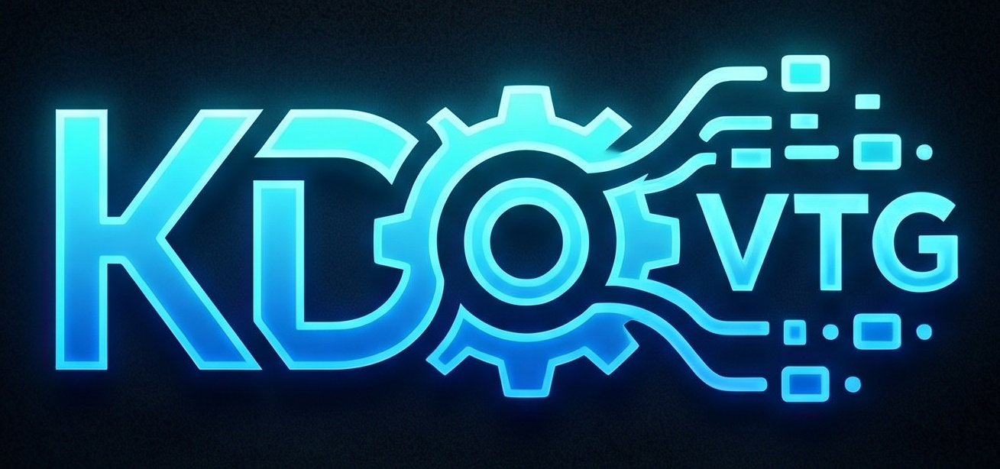
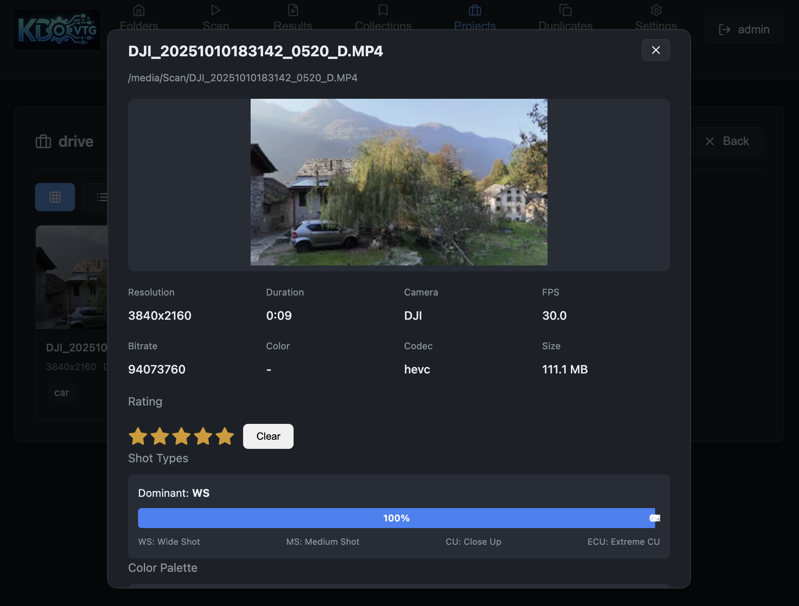

# KDO Video Tagger



**Organize, tag, and manage your video projects with AI-powered metadata extraction.**

KDO Video Tagger is a self-hosted web application that automatically extracts technical metadata from your videos and adds intelligent tagging powered by AI object detection.

[](https://opensource.org/licenses/MIT)
[](https://www.python.org/downloads/)
[](https://www.docker.com/)
[](https://github.com/omrik/kdo-vtg/releases)

---

## Why KDO Video Tagger?

### Save Hours of Manual Work
Stop manually typing metadata for every clip. Scan folders with thousands of videos in minutes and get comprehensive information automatically.

### AI-Powered Object Detection
Enable YOLO-based object detection to automatically identify what's in your footage - people, vehicles, animals, equipment, and more.

### Perfect for Video Editors
Export clean CSV or Excel spreadsheets ready for Premiere Pro, DaVinci Resolve, or Final Cut Pro workflows.

### Works Where You Work
- **NAS** - Run on your UGREEN NAS or any Docker-enabled NAS
- **Local** - Works on Mac, Windows, or Linux
- **Private** - Self-hosted, your videos never leave your network

---



---

## Key Features

| Feature | Description |
|----------|-------------|
| **Automatic Metadata** | Resolution, duration, FPS, codec, bitrate, camera model |
| **AI Object Detection** | Identify people, objects, and scenes in your footage |
| **Scene Detection** | Automatically find shot boundaries and scene changes |
| **Color Analysis** | Extract dominant color palettes from videos |
| **GPS Location** | Read GPS coordinates from drone and action camera footage |
| **Star Ratings** | Rate your best clips |
| **Collections & Projects** | Organize videos your way |
| **Duplicate Detection** | Find similar or duplicate videos |
| **Export** | CSV, Excel, EDL (for Premiere/DaVinci), PDF shot lists |

---

## Quick Start

```bash
docker pull ghcr.io/omrik/kdo-vtg:latest
docker run -d -p 8080:8000 \
  -v ~/Movies:/media:ro \
  -v kdo-vtg-config:/app/config \
  ghcr.io/omrik/kdo-vtg:latest
```

Access at `http://localhost:8080`

---

## Supported Cameras

- DJI Drones (Mavic, Mini, Phantom, Inspire)
- GoPro
- iPhone
- Insta360
- Sony, Canon, Nikon
- Any camera with MP4/MOV files

---

## Documentation

- [Installation Guide](docs/INSTALLATION.md) - Detailed setup for NAS and local
- [User Guide](docs/USAGE.md) - How to use all features
- [Development](docs/DEVELOPMENT.md) - For contributors

---

## Support This Project

If KDO Video Tagger saves you time, consider buying me a coffee:

[](https://buymeacoffee.com/omrik)

---

## Tech Stack

Python • FastAPI • React • TypeScript • FFmpeg • YOLOv8 • Docker

---

## License

[MIT](LICENSE)
