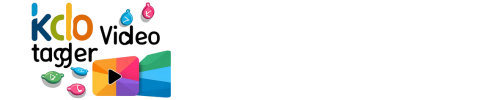

# KDO Video Tagger (kdo-vtg)



**Kedem Omri Video Tagger** - A self-hosted video metadata tagger with web UI for NAS systems. Extracts technical metadata using ffprobe and optionally detects objects using YOLOv8.

## Features

- **Web UI** - Modern React interface for browsing, scanning, and managing videos
- **Metadata Extraction** - Resolution, duration, FPS, codec, bitrate, camera type, date
- **Object Detection** - Optional YOLOv8 tagging (toggleable for performance)
- **Folder Browsing** - Navigate NAS folders directly from the UI
- **Progress Tracking** - Real-time scan progress with cancel support
- **Export** - Download results as CSV or Excel files
- **NAS Optimized** - Designed for UGREEN NAS with Dockhand support

## Hardware Requirements

- **UGREEN NAS**: DXP4800 Plus (Pentium Gold 8505) or similar
- **Storage**: Sufficient space for video files
- **RAM**: 4GB minimum, 8GB recommended for YOLO processing

## Installation on UGREEN NAS

### Step 1: Install Dockhand

Dockhand is a modern Docker management UI for NAS systems.

1. Install **Docker** from UGREEN App Center
2. Open **Docker** → **Project** → **Create**
3. Name: `dockhand`, Create folder: `dockhand`, Select → **Confirm**
4. Paste and deploy:

```yaml
services:
  dockhand:
    image: fnsys/dockhand:latest
    container_name: Dockhand
    ports:
      - 3866:3000
    volumes:
      - /volume1/docker/dockhand:/app/data:rw
      - /var/run/docker.sock:/var/run/docker.sock
    restart: always
```

5. Access Dockhand at `http://your-nas-ip:3866`

### Step 2: Add GitHub Registry (for updates)

1. In Dockhand, go to **Settings** → **Registries**
2. Click **+ Add registry**
3. Name: `GitHub`, URL: `https://ghcr.io`
4. Click **+ Add**

### Step 3: Deploy kdo-vtg

1. Go to **Stacks** → **+ Create**
2. Name: `kdo-vtg`
3. Create folder `/volume1/docker/kdo-vtg/` via UGREEN Files app
4. Paste the compose:

```yaml
services:
  kdo-vtg:
    image: ghcr.io/omrik/kdo-vtg:latest
    container_name: kdo-vtg
    ports:
      - "8080:8000"
    volumes:
      - kdo_vtg_config:/app/config
      - /volume1/media:/media:ro
    environment:
      - TZ=Europe/Bucharest
      - PUID=1000
      - PGID=100
    restart: unless-stopped

volumes:
  kdo_vtg_config:
```

5. Click **Create & Start**

### Step 4: Mount Your Videos

Create a folder in UGREEN Files app at `/volume1/media/` and copy your videos there, or mount an existing folder.

### Step 5: Access kdo-vtg

Open `http://your-nas-ip:8080` in your browser.

## Usage

### Selecting a Folder

1. Go to the **Folders** tab
2. Click on a folder to browse its contents
3. Select a folder containing videos

### Scanning Videos

1. Go to the **Scan** tab
2. Configure settings:
   - **YOLO Object Detection**: Enable for object tagging (slower)
   - **Sample Interval**: Seconds between YOLO checks (default: 10)
   - **YOLO Model**: Nano (fast) to Large (accurate)
3. Click **Start Scan**
4. Monitor progress in real-time
5. Cancel anytime if needed

### Viewing Results

1. Go to the **Results** tab
2. Browse scanned videos with all metadata
3. Click **Open** to open video file directly

### Exporting Data

- **CSV**: Click the CSV button for spreadsheet format
- **Excel**: Click the Excel button for formatted .xlsx file

## Configuration

### Environment Variables

| Variable | Description | Default |
|----------|-------------|---------|
| `TZ` | Timezone | UTC |
| `PUID` | User ID for file permissions | 1000 |
| `PGID` | Group ID for file permissions | 100 |
| `DATABASE_URL` | SQLite database path | `sqlite:///./config/kdo-vtg.db` |

### YOLO Model Options

| Model | Speed | Accuracy | RAM Usage |
|-------|-------|----------|-----------|
| `yolov8n.pt` | Fastest | Good | ~1GB |
| `yolov8s.pt` | Fast | Better | ~2GB |
| `yolov8m.pt` | Medium | Great | ~4GB |
| `yolov8l.pt` | Slow | Excellent | ~8GB |

## Architecture

```
kdo-vtg/
├── backend/           # FastAPI backend
│   ├── main.py        # API endpoints
│   ├── scanner.py     # ffprobe + YOLO scanning
│   ├── database.py    # SQLite models
│   └── export.py      # CSV/Excel export
├── frontend/          # React + Vite frontend
│   └── src/
│       ├── App.tsx   # Main UI component
│       └── index.css # Styles
├── docker/            # Docker deployment files
└── config/            # Runtime configuration
```

## Building from Source

```bash
# Clone the repository
git clone https://github.com/omrik/kdo-vtg.git
cd kdo-vtg

# Build the Docker image
docker build -t kdo-vtg .

# Run
docker run -d \
  --name kdo-vtg \
  -p 8080:8000 \
  -v kdo-vtg-config:/app/config \
  -v /path/to/videos:/media:ro \
  kdo-vtg
```

## Development

```bash
# Backend
cd backend
pip install -e .
uvicorn backend.main:app --reload

# Frontend
cd frontend
npm install
npm run dev
```

## Tech Stack

- **Backend**: Python, FastAPI, SQLAlchemy, SQLite
- **Frontend**: React, TypeScript, Vite
- **Metadata**: FFprobe (FFmpeg)
- **Object Detection**: Ultralytics YOLOv8
- **Export**: openpyxl (Excel), Python csv
- **Deployment**: Docker, Dockhand-ready

## License

MIT License - See [LICENSE](LICENSE)

## Acknowledgments

- Built with [Ultralytics YOLOv8](https://github.com/ultralytics/ultralytics)
- Inspired by [MediaLyze](https://github.com/frederikemmer/MediaLyze)
- Optimized for UGREEN NASync DXP4800 Plus
