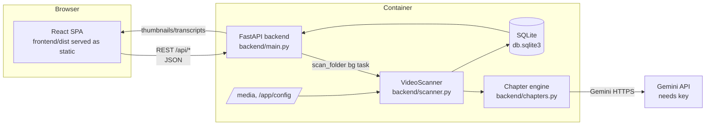
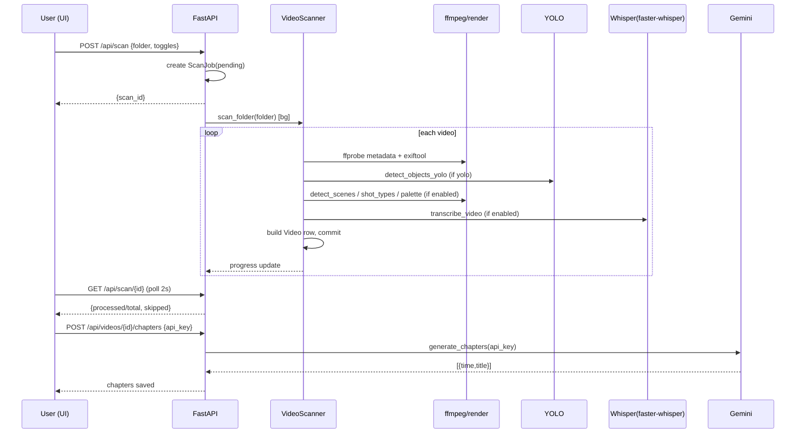
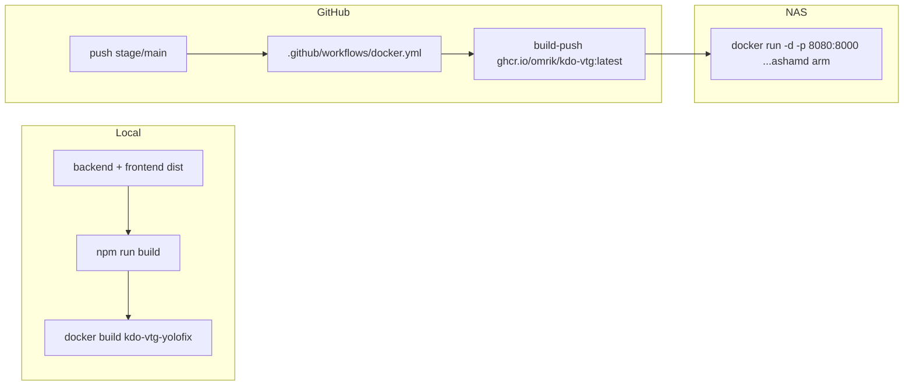

# KDO Video Tagger — Architecture & Function Reference

_Self-hosted video indexing + analysis app. FastAPI backend, SQLAlchemy/SQLite,
React (Vite) frontend, runs in Docker on self-hosted NAS media. All analysis is
local (YOLO, SceneCut, Whisper); only YouTube-chapter planning calls Gemini._

> Repo root: `/Users/omrik/Documents/kdo-vtg` · Branch `stage` holds new work;
> `main` is the promoted/live image. Latest shipped versions are in `VERSION`.

---

## 1. High-level overview



**Feature flow:** Folders → pick folder → POST`/api/scan` (async) → `VideoScanner`
walks folder, extracts metadata per video (ffprobe + exiftool), and optionally runs
YOLO object detection, scene detection, shot-type classification, color palette,
GPS extraction, and Whisper transcription → rows in `videos` table. Chapters are
planned on demand via `POST /api/videos/{id}/chapters` (Gemini).

---

## 2. Repository layout

```
kdo-vtg/
├── backend/                 # FastAPI app (singledir package)
│   ├── main.py              # All API routes (FastAPI app)  ~1750 lines
│   ├── scanner.py           # VideoScanner: metadata, YOLO, scenes, shots, colors, GPS, Whisper
│   ├── chapters.py          # Gemini chapter planning (prompt build + HTTP call)
│   ├── database.py          # SQLAlchemy models (Video, ScanJob, Folder, User, Collections…)
│   └── settings.py          # Settings keys + defaults + settings_payload()
├── frontend/
│   ├── src/
│   │   ├── App.tsx          # Root SPA: tabs, state, scan flow, modals  ~2600 lines
│   │   ├── api/index.ts     # Typed HTTP client for every API route
│   │   ├── types/index.ts   # VideoItem, ScanJob, Folder, Collection, Project…
│   │   └── components/      # VideoCard, VideoListView, VideoModal
│   └── dist/                # Built static assets (served by backend)
├── tests/                   # pytest API tests
├── scripts/                 # build/test helpers
├── docker/                  # docker-compose.prod + Docker Hub compose
├── docker-compose.yml       # thin wrapper for NAS compose include
├── Dockerfile               # Builds backend image, serves frontend/dist
├── ugreen/                  # UGREEN App Store packaging
└── .github/workflows/       # CI
```

---

## 3. Backend modules

### 3.1 `backend/main.py` — REST API (FastAPI)

All endpoints require a valid bearer token (HTTPBearer) except health/version/auth.

| HTTP / Route | Handler | Purpose |
|---|---|---|
| GET `/api/health` | `health_check` | liveness for Docker HEALTHCHECK |
| GET `/api/version` | `get_app_version` | returns version from `VERSION` |
| GET `/` | `get_setup_status` | bootstrap: is auth configured? |
| POST `/api/auth/register` | `register` | create first admin |
| POST `/api/auth/login` | `login` | issue JWT |
| GET `/api/auth/me` | `get_me` | current user |
| POST `/api/auth/change-password` | `change_password` | change own password |
| GET `/api/settings` | `read_settings` | all settings + computed config |
| POST `/api/settings` | `update_settings` | persist settings |
| GET `/api/folders` | `list_folders` | top-level media folders |
| GET `/api/folders/{path:path}` | `get_folder_contents` | folder listing w/ video counts |
| POST `/api/scan` | `start_scan` | enqueue scan job (bg task) |
| POST `/api/scan/{scan_id}/chapters` | — | generate chapters for a job |
| GET `/api/scan/{scan_id}` | `get_scan_status` | poll job progress |
| POST `/api/scan/{scan_id}/cancel` | `cancel_scan_job` | cancel running scan |
| GET `/api/videos` | `get_videos` | list/filter/sort/search videos |
| GET `/api/videos/{id}` | `get_video` | single video detail |
| GET/POST `/api/videos/{id}/tags` | tag ops | add/list tags |
| DELETE `/api/videos/{id}/tags/{tag}` | remove tag | |
| POST `/api/videos/{id}/scenes` | `detect_video_scenes` | run scene detection on one video |
| GET/POST `/api/videos/{id}/transcript` | transcribe | on-demand Whisper |
| GET/POST `/api/videos/{id}/chapters` | chapters | plan chapters via Gemini |
| POST `/api/videos/batch/*` | batch ops | tag/delete/add-to-collection/project |
| GET `/api/videos/duplicates` | `find_duplicates` | same-content detection |
| GET `/api/stats`, `/api/tags` | stats | dashboard aggregates |
| POST `/api/export/csv&#124;excel&#124;edl&#124;pdf` | export | graded exports |
| CRUD `/api/collections`, `/api/projects` | collection/project mgmt | organize videos |

#### Scan flow internals
- `ScanRequest` Pydantic body: `folder_path`, `yolo_enabled`, `sample_interval`,
  `model_name`, plus feature toggles `scene_detection_enabled`,
  `shot_type_enabled`, `color_palette_enabled`, `transcribe_enabled`, `whisper_model`.
- `start_scan` creates a `ScanJob` (status `pending`) and schedules
  `scan_task(url, scan_id, folder, …)` via FastAPI `BackgroundTasks`.
- `scan_task` spawns a `VideoScanner`, calls `scan_folder(folder_path)`.
- `get_scan_status` returns progress + counts; frontend polls every 2 s.

---

### 3.2 `backend/scanner.py` — `VideoScanner` class

Constructor toggles: `yolo_enabled`, `sample_interval`, `model_name`
(scene/shot/color/gps/transcribe enabled flags).

| Method | Purpose |
|---|---|
| `extract_metadata_ffprobe(filepath)` | ffprobe → {resolution, width/height, duration, fps, codec, bitrate} |
| `extract_metadata_exiftool(filepath)` | exiftool JSON → camera_model, create_date, GPS, color_profile |
| `extract_gps_data(filepath, exiftool_data)` | GPS from exiftool keys (ISO6709 / DJI `location` / DMS), falls back to ffprobe tags |
| `extract_camera_type(filepath, filename)` | detect `DJI`/`GoPro`/`iPhone`/`Insta360` from encoder + name |
| `extract_date_from_filename` / `extract_metadata` | derive creation date from filename patterns |
| `extract_thumbnail(filepath, duration)` | 320×180 JPEG via ffmpeg at 10% mark |
| `detect_objects_yolo(filepath)` | YOLOv8 (`yolov8n.pt`) over sampled frames → tag set |
| `detect_shot_types(filepath)` | frame diffing → counts per WS/MS/CU/ECU → dominant shot |
| `detect_scenes(filepath)` | frame-difference scene cuts → `[{timestamp, start_time, end_time,…}]` |
| `extract_color_palette(filepath)` | k-means dominant colors (5) |
| `transcribe_video(filepath)` | faster-whisper base CPU → timestamped segments |
| `scan_video(filepath)` | pipelines all enabled analyses into a `Video` row |
| `scan_folder(folder_path)` | walks folder; per-video try/except; tracks progress + failures |

`scanner.scan_folder` skip logic: when `only_missing=True` (backfill scans), a video
is skipped if `_missing_analyses(video)` returns empty — i.e. all enabled analyses
already present. Tracks `skipped_files` on the ScanJob.

---

### 3.3 `backend/chapters.py` — Gemini chapter planner

```mermaid
flowchart LR
    A[GET /api/videos/{id} data] --> B[build_prompt]
    B --> C[generate_chapters]
    C --> D[Gemini generateContent]
    D --> E[filter_scene_cuts + parse]
    E --> F[[GET chapters / save]]
```

| Function | Purpose |
|---|---|
| `filter_scene_cuts(scenes, min_duration, min_gap, max_cuts)` | drop noisy <2 s cuts, de-dupe <5 s closes |
| `build_prompt(video, transcript, series_context, extra_rules)` | assemble chapter-planning prompt |
| `generate_chapters(prompt, api_key, model)` | call Gemini; return `[{time,title}]` |
| `to_hhmmss` / `parse_timestamp` | timestamp helpers |

Uses `GEMINI_API_KEY` (settings/env). No key → clean `ValueError` → 503/400 response.

---

### 3.4 `backend/database.py` — models

| Model | Fields (highlights) |
|---|---|
| `Video` | id, filename, filepath, resolution w/h, duration, fps, codec, bitrate, camera_type, color_profile, date_created, file_size, tags(JSON), thumbnail, `yolo_enabled`, scenes(JSON), `scene_detection_enabled`, shot_types(JSON), color_palette(JSON), gps_data(JSON), transcript(JSON), transcribe_enabled, chapters(JSON) |
| `ScanJob` | id, folder_path, status, yolo_enabled, sample_interval, started/completed_at, processed_files, skipped_files, error_message |
| `Folder` | path, name, video_count |
| `User` | username, email, hashed_password, is_active |
| `Collection` / `Project` | name, description, color, status (+ M2M video links) |
| `ScanSettings` table | `key`/`value` pairs (see `settings.py`) |

---

### 3.5 `backend/settings.py` — keys & defaults

- Media root (`media_root`), YOLO model (`model_name`), sample interval,
  scene/shot/color enabledness, Whisper model, Gemini model + API key,
  after-scan action. Exposed as `/api/settings` and mirrored in
  `settings_payload()`.

---

## 4. Frontend

### 4.1 `frontend/src/types/index.ts`
`VideoItem` (dead fields: shot_types, scenes, tags, gps_data, rating, transcript…),
`ScanJob`, `Folder`, `FolderContent`, `Collection`, `Project`, `Stats`,
`ScanSettings`, `AppSettings`.

### 4.2 `frontend/src/api/index.ts`
Typed wrappers grouped by resource: `auth`, `folders`, `scan` (start/status/cancel),
`videos`, `tags`, `stats`, `export`, `collections`, `projects`, `settings`.

### 4.3 `frontend/src/components/`
| File | Purpose |
|---|---|
| `VideoCard.tsx` | card thumbnail (aspect from resolution) + tags + star rating + GPS pin |
| `VideoListView.tsx` | grid/list toggle + Results sortable/filtered view |
| `VideoModal.tsx` | video detail (scenes, shot bars, color, GPS map, transcript, chapters) |

### 4.4 `frontend/src/App.tsx` — app shell
Tab IDs from `types`: `folders` (browse), `scan` (Scan tab), `results`, `collections`,
`projects`, `duplicates`, `settings`. State: `selectedFolder`, `filters`, `videos`,
`currentScan`, `stats`, auth token. `activeTab` persisted to `#hash` (no history
pollution). Scan modal collects scanSettings toggles → `POST /api/scan`.

---

## 5. Analysis pipeline detail



---

## 6. Build / deploy / CI



- Model weights baked at `/opt/kdo-vtg/models/yolov8n.pt` (non-root readable), not
  in a volume → survives container recreation.
- `VERSION` auto-bumps on every commit via git hook.
- GEMINI_API_KEY / faster-whisper pulled at runtime from env / settings (never baked
  into the image).
- CI runs pytest against a fresh container (local via `scripts/build-and-test.sh`).

---

## 7. Key invariants (for future work — do not break)

1. **Local-only analysis.** No video bytes leave the NAS except the chapter prompt
   (metadata only) to Gemini. Never upload raw footage.
2. **Auth-first.** Every `/api/*` except health/version/login/setup must
   authenticate via bearer token.
3. **`ugreen/project.yaml` + `docs/screenshots/*` are pre-existing unrelated
   changes** — leave them out of feature commits.
4. **Push pattern only per user approval.** Feature work goes to `stage`; promote
   to `main` after user says go, and repull the live container.
5. **Don't bake secrets into the image or repo.** GEMINI_API_KEY comes from
   compose env passthrough / Settings.
6. **Backfill-friendly:** use `only_missing` for rescan so already-analyzed videos
   are not reprocessed.
</content>