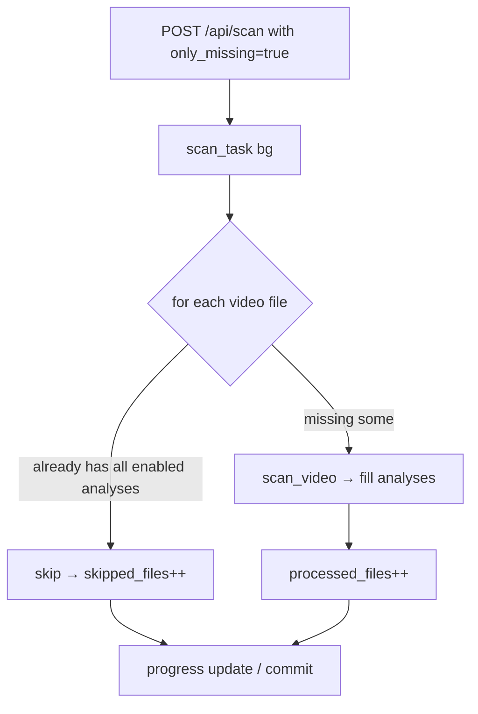

# KDO Video Tagger — Developer Runbook

_How to build, run, test, and ship changes — and where the project currently
stands. Read `ARCHITECTURE.md` first for the full map. This is the "local loop"
reference so any session can pick up mid-air._

---

## 1. Where things run

| Target | Image / tag | Port | Purpose |
|---|---|---|---|
| Live on NAS (`kdo-vtg`) | `ghcr.io/omrik/kdo-vtg:latest` | 8080 | production instance, admin/admin123 |
| Local test (light) | `kdo-vtg-yolofix` | 8091 | 3-clip smoke: `/media` + DJI test files |
| Local build during work | `kdo-vtg-yolofix` (rebuilt) | 8091 | validate before committing |

Live mount for scan backfill = NAS `/media` (read-only `.ro`).
Local scratch DB/config lives under `~/Documents/opencode`.

### Live container details (NAS)
- Image `ghcr.io/omrik/kdo-vtg:latest`, network `kdo-vtg_default`,
  restart `unless-stopped`, mounts media RO + `/media`; config volume preserved
  across recreates.
- Health check: `GET /api/health` → 200. Watch scan progress at `/api/scan/{id}`.

---

## 2. The build → test → ship loop

Everything for a new feature lands on **`stage`** and is validated locally first.
Push to `main` (the live image) **only after the user approves**.

```mermaid
flowchart LR
    A[make edits on stage branch] --> B[npm run build (frontend)]
    B --> C[docker build -t kdo-vtg-yolofix .]
    C --> D[docker cp dist -> live/test container]
    D --> E[Playwright + pytest verify]
    E --> F{approved by user?}
    F -- no --> A
    F -- yes --> G[git push origin HEAD:stage + branch -f main]
    G --> H[CI green ≈26min]
    H --> I[docker pull + recreate live container]
```

### Commands

```bash
# 1. Build frontend (Vite → frontend/dist)
cd frontend && npm run build && cd ..

# 2. Build the Docker image locally
docker build -t kdo-vtg-yolofix .

# 3. Ship the new static bundle (no full redeploy needed for UI-only changes)
docker cp frontend/dist/. kdo-vtg:/app/static/
docker restart kdo-vtg          # pick up new main.py/scanner.py if backend changed

# 4. Iterate: rerun steps 1+3 on changes, restart container

# 5. Verify with tests (POSTMAN-less, needs the container on BASE_URL)
BASE_URL=http://localhost:8080 pytest tests/ -q
```

### Backend-only quick test (no container)
Fast to sanity-check imports/logic without Docker:

```bash
cd kdo-vtg
python3 -c "from backend.database import migrate_db; migrate_db()"
pytest backend/tests or tests/ 2>/dev/null
```

---

## 3. The backfill / incremental-scan feature (CURRENT IN-FLIGHT)

> Status: implemented in `backend/scanner.py` + API (`only_missing`) but **not
> committed/pushed yet** — it is the active `stage` feature being validated.

### Goal
Re-analyze only the videos in the library that are **missing** result data, so
existing scans don't overwrite good data or waste hours re-YOLO-ing the same
108 files. Compatible with **GPS backfill** (45/108 already had GPS).

### How it works
- New `ScanRequest`: `only_missing: bool = False`.
- `VideoScanner.__init__` gains `only_missing` + `_missing_analyses(video)` helper
  that returns which enabled analyses are absent on a given video (shot_types,
  scenes, yolo tags, color palette, transcript…).
- `scan_folder(..., only_missing=True)` skips each video where the enabled
  analyses already exist → `skipped_files` counter + `ScanJob.skipped_files`
  column persist the count (DB migration already added).
- API exposes it, and frontend Scan tab will get a "Scan only missing analysis"
  toggle (P1).



---

## 4. Scanning modes (the 4 analysis layers)

| Layer | Backend fn | Enabled by | Output saved on `Video` |
|---|---|---|---|
| YOLO objects | `detect_objects_yolo` → `detect_objects_yolo` | `yolo_enabled` | `tags` (JSON) |
| Scene cuts | `detect_scenes` | `scene_detection_enabled` | `scenes` (JSON) |
| Shot types | `detect_shot_types` | `shot_type_enabled` | `shot_types` (JSON) |
| Color palette | `extract_color_palette` | `color_palette_enabled` | `color_palette` (JSON) |
| GPS | `extract_gps_data` | `gps_extraction_enabled` | `gps_data` (JSON) |
| Transcript | `transcribe_video` | `transcribe_enabled` | `transcript` (JSON) |
| Chapters | `generate_chapters` (Gemini) | repo `chapters.py` | `chapters` (JSON) |

`only_missing=True` scans skip a video if **all enabled layers above already
produced non-empty output** for it.

---

## 5. Current open work (carry-forward — read before continuing)

1. **Backfill (`only_missing`)** — code written in `scanner.py` + `main.py` +
   DB migration; NOT committed. Next: wire into Scan tab UI toggle + test the
   skipped counter, then local-validate against the live NAS library (108 videos,
   most missing shot_types). Get approval before pushing.
2. **UGREEN App Store submission** — `ugdev.sig` still not received; `.upk` build
   artifacts exist. Ping UGREEN when key arrives; no code work needed.
3. **README / growth** — done + pushed. Screenshots exist in `docs/…`.

### Repo hygiene gotchas
- `ugreen/project.yaml` + `docs/screenshots/*` are **pre-existing unrelated
  changes** — do not bundle them into feature commits.
- Before committing: `git status`; keep diffs focused; seed admin via
  `from backend.database import SessionLocal, User` + `passlib.hash.bcrypt`
  (resident pattern — do NOT use `backend.models`).
- `push HEAD:stage && branch -f main` only after user says go.

---

## 6. Useful scripts
- `scripts/build-and-test.sh` — docker build + full pytest (local)

---

## 7. Docker Hub / NAS promo (production gate)
- CI pushes amd64 image `ghcr.io/omrik/kdo-vtg:latest` from `Dockerfile` when
  PRs merge to `main` (see `.github/workflows/docker.yml`). To update the live
  NAS container after a green CI: `docker pull ...:latest` + `docker restart`.
- `docker-compose.prod.yml` wires the prod mount + GEMINI_API_KEY passthrough.
