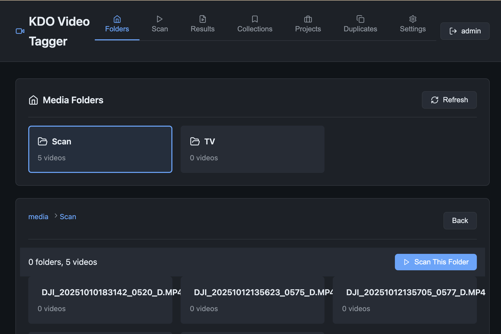
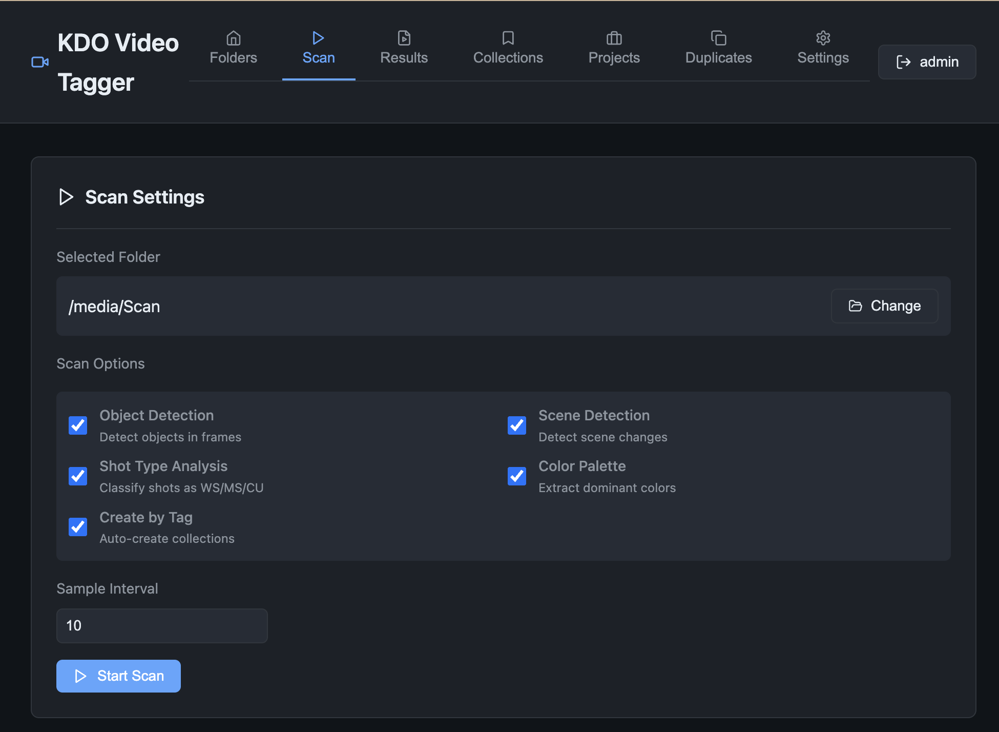
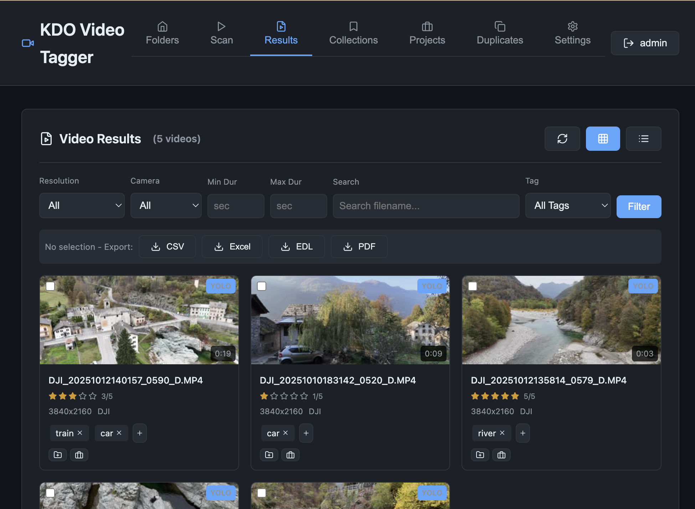
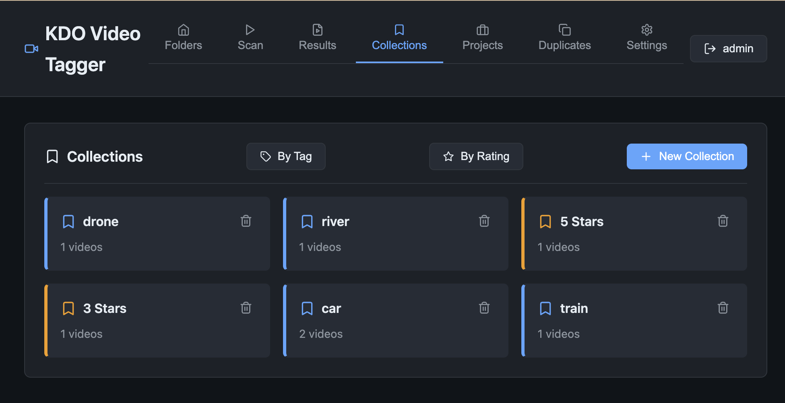
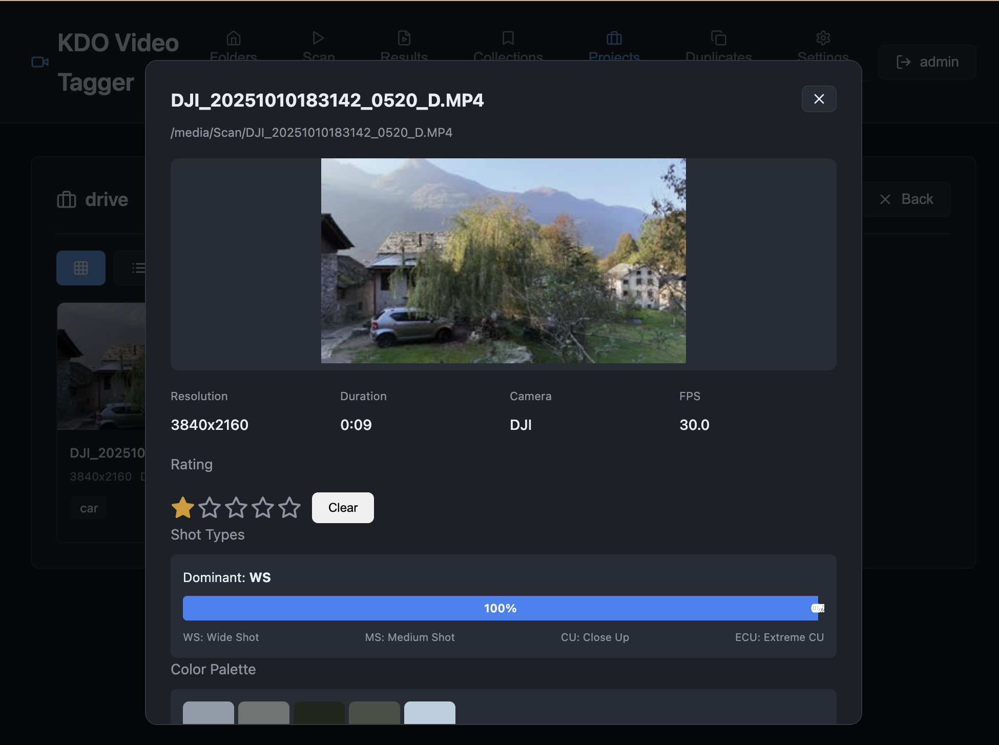

# KDO Video Tagger - Usage Guide

## Overview

KDO Video Tagger is a self-hosted video metadata tagger for organizing video projects. It runs as a Docker container and provides a web UI for scanning, tagging, and managing video files.

## Features

- **Video Scanning**: Extract metadata (resolution, duration, FPS, codec, bitrate) using ffprobe
- **Object Detection**: YOLO-based detection for identifying objects in videos
- **Scene Detection**: Automatically detect shot boundaries
- **Shot Type Analysis**: Classify shots as Wide (WS), Medium (MS), Close-Up (CU), or Extreme Close-Up (ECU)
- **Color Palette**: Extract dominant colors from videos
- **GPS Location**: Read GPS coordinates from video metadata
- **Transcription**: Local speech-to-text via faster-whisper (free, on-device)
- **YouTube Chapters**: AI-generated chapter plans from visual index + transcript (optional, needs a Gemini API key)
- **Star Ratings**: Rate videos 1-5 stars
- **Custom Tags**: Add and manage tags per video
- **Collections**: Group videos into collections
- **Projects**: Organize videos into editing projects
- **Duplicate Detection**: Find potential duplicate videos
- **Export**: CSV, Excel, EDL (Premiere/DaVinci), and PDF shot lists

## Getting Started

### Installation

#### Docker (Local/Mac/PC)

```bash
# Pull the image
docker pull ghcr.io/omrik/kdo-vtg:latest

# Run with your video folder mounted
docker run -d -p 8080:8000 \
  -v /path/to/your/videos:/media:ro \
  -v kdo-vtg-config:/app/config \
  ghcr.io/omrik/kdo-vtg:latest

# Access at http://localhost:8080
```

#### NAS (Docker)

```bash
docker run -d -p 8080:8000 \
  -v /path/to/videos:/media:ro \
  -v kdo-vtg-config:/app/config \
  --name kdo-vtg \
  ghcr.io/omrik/kdo-vtg:latest
```

### First Run

1. Open http://localhost:8080 (or your NAS IP)
2. Create your admin account
3. Start browsing and scanning videos

## User Guide

### Browsing Videos

1. Go to the **Folders** tab
2. Navigate through your media folders
3. Select a folder to view its contents



### Scanning Videos

1. Navigate to a folder in the Folders tab
2. Click **Scan This Folder**
3. Configure scan options (shown in 2-column grid):
   - **Object Detection**: Detect objects in video frames
   - **Scene Detection**: Detect scene/shot boundaries
   - **Shot Type Analysis**: Classify shots as WS/MS/CU
   - **Color Palette**: Extract dominant colors
   - **Create by Tag**: Auto-create collections after scan
4. Set **Sample Interval** (seconds between samples)
5. Click **Start Scan**



### Viewing Results

1. Go to the **Results** tab
2. Switch between **Grid** and **List** views
3. Use filters to narrow down results:
   - Resolution
   - Camera type
   - Min/Max duration
   - Tags



### Video Details

Click on any video to open the details modal showing:
- Metadata (resolution, duration, FPS, camera)
- Star rating
- GPS coordinates (with link to Google Maps)
- Shot type breakdown (if analyzed)
- Color palette (if extracted)
- Detected scenes (if analyzed)
- Transcript (if transcribed)
- Chapters (if generated)
- Tags

### Transcription (local, free)

1. Open a video's details modal
2. Click **Transcribe**
3. The audio is transcribed locally on your server with [`faster-whisper`](https://github.com/SYSTRAN/faster-whisper) — no upload, no API key needed

Notes:
- Choose the **Whisper model** in Settings → AI & Transcription. `base` is the fast default; `large-v3` is the most accurate but much slower on low-end NAS hardware.
- Videos with no audio track, or silent videos, return an empty result — that's expected.
- Transcript segments appear in the video's details panel.

### YouTube Chapters (optional, needs a Gemini API key)

1. Open a video's details modal
2. Click **Generate chapters**
3. The visual index (scene cuts, YOLO tags, shot types) plus the transcript get sent to Google
   Gemini and returned as timestamped chapter titles (e.g. `00:00 Intro`, `01:24 Interview`, `12:40 Wrap-up`)

Notes:
- This is the **only** feature that contacts an external service. Everything else runs locally.
- Requires your own API key, set in Settings → AI & Transcription (or the `GEMINI_API_KEY`
  environment variable). It is stored server-side, never committed, and masked in the UI.
- Chapters need a transcript first — if the clip has no speech, generation returns an empty result.
- Videos that belong to the same **Project** are passed to Gemini as `SERIES_CONTEXT`, so episode
  titles stay consistent in style.

### Settings Tab

The **Settings** tab is where you manage the application:

- **Account** — change your display name and password
- **AI & Transcription** — Gemini API key (masked in the UI), Gemini model, Whisper model
- **Scan Defaults** — default analysis options for new scans (object/scene/shot/color, sample
  interval, create-by-tag). These pre-fill the Scan panel.
- **Media Root** — the in-container path where your videos live (default `/media`). Change it and
  the Folders browser re-points automatically.
- **Database** — export/import/reset the database
- **About** — version, links, sponsorship

### Organizing Videos

#### Collections
- Create collections to group videos by category
- Auto-create collections by tag
- Add/remove videos from collections



#### Projects
- Create projects for editing workflows
- Add videos to projects
- Track project status



### Batch Operations

1. Select multiple videos using checkboxes
2. Use batch actions:
   - Add to Collection
   - Add to Project
   - Add/Remove Tags
   - Delete

### Exporting

Available export formats:
- **CSV**: Spreadsheet format
- **Excel**: .xlsx with formatting
- **EDL**: CMX 3600 format for Premiere Pro/DaVinci Resolve
- **PDF**: Shot list document

### Finding Duplicates

1. Go to the **Duplicates** tab
2. Click **Find Duplicates**
3. Review potential duplicates
4. Delete unwanted copies

## Troubleshooting

### No videos found
- Check that your media folder is mounted correctly
- Verify the path in the container matches your video location

### YOLO not working
- YOLO requires significant memory
- Try increasing Docker memory limits
- Use a smaller sample interval

### Database errors
- Go to Settings > Reset to start fresh
- Or Settings > Import to restore a backup

## API

The application provides a REST API at `/api/`:

- `GET /api/folders` - List media folders
- `GET /api/videos` - List all videos
- `POST /api/scan` - Start a scan job
- `POST /api/videos/{id}/transcribe` - Transcribe a video locally (faster-whisper)
- `POST /api/videos/{id}/chapters` - Generate Gemini chapters for a video
- `GET /api/settings` / `POST /api/settings` - Read/update app settings
- `GET /api/health` - Health and capability check (includes `gemini_configured`)
- `GET /api/collections` - List collections
- `POST /api/export/csv` - Export as CSV
- `POST /api/export/edl` - Export as EDL
- `POST /api/export/pdf` - Export as PDF

All endpoints require authentication (JWT Bearer token).

## Architecture

```
┌─────────────────────────────────────────┐
│              React Frontend              │
│           (Served by FastAPI)            │
└─────────────────┬───────────────────────┘
                  │
┌─────────────────▼───────────────────────┐
│              FastAPI Backend            │
├─────────────────────────────────────────┤
│  Scanner (ffprobe, OpenCV, YOLO)       │
│  Auth (JWT)                            │
│  Database (SQLite)                     │
└─────────────────────────────────────────┘
```

## License

MIT License
